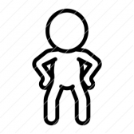

tells about me in the best way possible...............

.gif)
# Shreyansh Shukla 

<!--
    &nbsp; 
-->

###  **Hello world!** &nbsp;

  <em>
    I am a 3rd Year undergraduate from <a href="https://www.smu.edu.in/"> <b>Sikkim Manipal Institute of Technology</b>,rangpo,sikkim</a>.  
    A budding <b>Software Developer</b>  and a <b>Cyber Security/web dev/competitive programming  Enthusiast,</b>&nbsp;  who is <b>obsessed</b>
    with the idea of <b>improving</b> himself and wants a <b>platform</b> to 
    <b>grow</b> and 
    <b>excel.</b> 
  </em>  

 

-  I’m _currently_ **sleeping** 😴 or _working_ on my **laptop** 👨‍💻
-  I’m _currently learning_ how to **flex README** on my **profile** 💪.
-  I’m _looking_ for _help_ with **wifi connection 🌠and with my DSA skills too**
- **Ask me about anything and i won't let you go**    -  **empty handed but do not take advantage of it!!!!!**
-  **Pronouns:** [_He/Him_](https://pronoun.is/he) 🧔
-  **Fun fact:** My _smartness_ 💡 lies in my _laziness_ 😴

 

 

 

!!!!#Connect with me#!!!!!!

|  | 
| 
 
| 
   
  | 
   
  | 
   
  | 
   
  |
  |

|
|
|

 

 

Marching Ahead Still like a Striver whatsoever happens!!!--->&nbsp;---->
&nbsp;---->
&nbsp;---->
&nbsp;---->
&nbsp;---->
&nbsp;---->
&nbsp;---->
&nbsp;---->
&nbsp;---->
&nbsp;---->
&nbsp;---->
&nbsp;---->
    &nbsp;---->
    &nbsp;

## 𝗠𝘆 𝗧𝗲𝗰𝗸 𝗦𝘁𝗮𝗰𝗸 ##

<table>
  <tbody>
    <tr valign="top">
      <td width="25%" align="center">
        𝗛𝗧𝗠𝗟𝟱   
        
      </td>
      <td width="25%" align="center">
        𝗖𝗦𝗦𝟯   
        
      </td>
      <td width="25%" align="center">
        𝗝𝗮𝘃𝗮𝗦𝗰𝗿𝗶𝗽𝘁   
        
      </td>
      <!--<td width="25%" align="center">
        𝗩𝘂𝗲   
        
      </td>-->
        <td width="25%" align="center">
            <b>Data St and Algo</b>   
        
      </td>
    </tr>
    <tr valign="top">
      <td width="25%" align="center">
        𝗪𝗲𝗯𝗽𝗮𝗰𝗸   
        
      </td>
      <td width="25%" align="center">
        𝗚𝗶𝘁   
        
      </td>
       <td width="25%" align="center">
        𝐀𝐧𝐠𝐮𝐥𝐚𝐫 𝐉𝐬   
        
      </td>
      <td width="25%" align="center">
        𝗩𝗦 𝗖𝗼𝗱𝗲   
        
      </td>
    </tr>
    <tr valign="top">
      <td width="25%" align="center">
        𝗟𝗲𝘀𝘀   
        
      </td>
      <td width="25%" align="center">
        𝗦𝗮𝘀𝘀/𝗦𝗖𝗦𝗦   
        
      </td>
      <td width="25%" align="center">
        𝗧𝗮𝗶𝗹𝘄𝗶𝗻𝗱𝗖𝘀𝘀   
        
      </td>
      <td width="25%" align="center">
<!--           **Competitive-programming**    -->
          <b>Competitive Coding</b>   
        
      </td>
    </tr>
  </tbody>
</table>

**Fun Fact:-**Press <kbd>Ctrl</kbd>+<kbd>C</kbd> to take a halt!!!!!!

